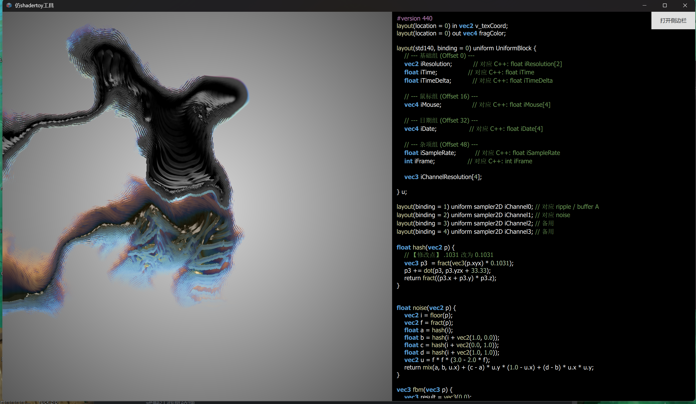
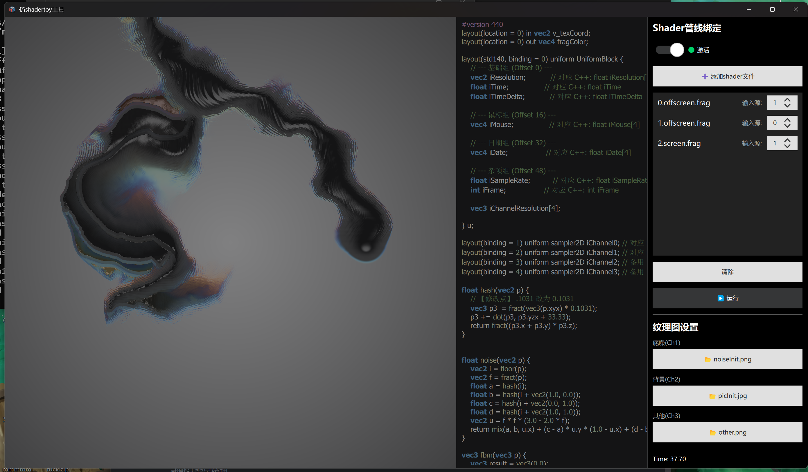
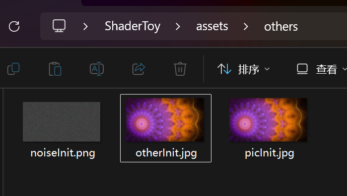

# Qt RHI Multi-Pass Shader Lab

---

## 🇨🇳 中文说明

### 项目简介
这是一个基于 **Qt 6 RHI (Rendering Hardware Interface)** 架构的高性能多通道着色器渲染引擎。项目模拟了 ShaderToy 的工作流，支持在本地环境进行复杂的离屏渲染（Offscreen Rendering）链构建与实时动态着色器编辑。

### 核心功能
* **多通道渲染流水线**：通过定义 `BufferSlot`（A, B, C, D, E）实现不同渲染通道（Pass）间的纹理传递与依赖绑定。
* **动态编译系统**：集成 `qsb` (Qt Shader Baker) 工具，支持在运行时将本地 GLSL 代码实时转换为 RHI 所需的 `.qsb` 序列化格式。
* **专业语法高亮**：基于 `QSyntaxHighlighter` 实现的 C++ 高亮引擎，支持 GLSL 关键字、宏定义、数字字面量及函数名的实时着色。
* **数据持久化缓存**：`RhiPingPongItem` 组件具备完善的缓存机制，即使渲染器实例被销毁，也能在下次启动时自动恢复着色器路径、纹理配置及通道绑定顺序。
* **ShaderToy 标准兼容**：内置标准的 `ShaderToyUniforms` 内存布局，完整支持 `iTime`, `iResolution`, `iMouse`, `iFrame` 等交互变量。

### 🚀 使用说明 / Usage Guide

#### 1. 环境准备 (Environment Setup)
为了确保程序能够正常编译 Shader，请务必在 `.exe` 运行目录下建立 `compiler` 文件夹，并放入以下文件：
* **核心工具**：`qsb.exe` (来自 Qt 官方工具链)。
* **依赖库**：确保放入运行 `qsb.exe` 所需的所有 Qt 动态链接库 (`.dll`)。

#### 2. 着色器编写规范 (Shader Code Convention)
你的 `.frag` 源码必须遵循特定的布局规范，以便与 C++ 后端的内存布局匹配：
* **Uniform 块**：必须使用 `layout(std140, binding = 0)` 定义 `UniformBlock`。
* **采样器绑定**：`iChannel0` 到 `iChannel3` 必须依次绑定在 `binding = 1` 到 `4`。

#### 3. 操作流程 (Workflow)
项目采用“保存即生效”的逻辑，请遵循以下步骤：
1. **展开侧边栏**：点击界面右上角的“打开侧边栏 (Open Sidebar)”按钮。
2. **编写代码**：在编辑器中输入你的 GLSL 代码。
3. **关键步骤 - 保存 (Save)**：编辑完成后，**必须按下 `Ctrl + S`** 进行保存。
4. **运行 (Run)**：点击侧边栏中的 **运行 (Run)** 按钮。此时系统会调用 `qsb` 重新编译并刷新渲染画面。

#### 4. 关键按钮注释 (Key Components)

| 界面显示 (CN)      | 英文注释 (EN)        | 功能说明 (Description)                             |
| :----------------- | :------------------- | :------------------------------------------------- |
| **运行**           | **Run**              | 触发编译并启动 RHI 渲染逻辑。                      |
| **Ctrl + S**       | **Save**             | 将编辑器内容写入本地文件（编译前必做）。           |
| **添加shader文件** | **Add Shader File**  | 导入新的 `.frag` 源码到管线列表。                  |
| **输入源**         | **Input Source**     | 设置当前 Pass 引用的纹理槽位或上一个 Pass 的输出。 |
| **纹理图设置**     | **Texture Settings** | 为 `iChannel1` - `iChannel3` 指定静态图片资源。    |

---

## 🇺🇸 English README

### Introduction
A high-performance multi-pass shader rendering engine built with **Qt 6 RHI**. It replicates the ShaderToy workflow for local development, enabling complex offscreen rendering chains and real-time shader editing.

### Key Features
* **Multi-Pass Pipeline**: Transfer textures and bind dependencies between different rendering passes via `BufferSlot` (A, B, C, D, E).
* **Dynamic Baking**: Integrates the `qsb` tool to compile GLSL source into RHI-compatible `.qsb` format on the fly during runtime.
* **Advanced Syntax Highlighting**: A custom C++ highlighter based on `QSyntaxHighlighter`, supporting real-time coloring for GLSL keywords, macros, literals, and functions.
* **State Persistence & Caching**: The `RhiPingPongItem` maintains a robust caching system, ensuring shader paths, textures, and binding orders are restored after renderer re-initialization.
* **ShaderToy Compatibility**: Standardized `ShaderToyUniforms` memory layout supporting common variables like `iTime`, `iResolution`, `iMouse`, and `iFrame`.

---

## 🛠️ 环境要求 / Requirements

* **Qt Version**: Qt 6.6+ (RHI & Shader Tools modules required).
* **Compiler**: C++17 compatible (MSVC 2019+, GCC 10+).
* **External Tool**: `qsb.exe` (Must be present in the application's executable directory under `/compiler/`).

---

## 📝 技术细节 / Technical Details

### Uniform 内存布局 / Uniform Layout
项目严格遵循 `std140` 布局以确保 GPU 端的数据对齐：

$$
\text{Offset 0: iResolution (vec2), iTime (float), iTimeDelta (float)}
$$
$$
\text{Offset 16: iMouse (vec4)}
$$
$$
\text{Offset 32: iDate (vec4)}
$$
$$
\text{Offset 64: iChannelResolution (vec4[4])}
$$

### 通道绑定逻辑 / Pass Binding Logic
渲染器通过 `inputBindOrder` 数组动态链接资源。每个 `RenderPass` 根据其 `inputSlot` 自动查找并绑定对应的离屏纹理或默认背景纹理。

---

## 📂 纹理资源规范 / Texture Assets Specification

项目使用的静态纹理资源必须存放于指定的路径，并严格遵守以下命名与格式要求，否则后端 RHI 逻辑将无法正确加载：

* **储存路径**：`./assets/others/`
* **文件命名与格式**：
    1. `noiseInit.png` (用于噪声初始化)
    2. `otherInit.jpg` (辅助纹理)
    3. `picInit.jpg` (基础背景纹理)

